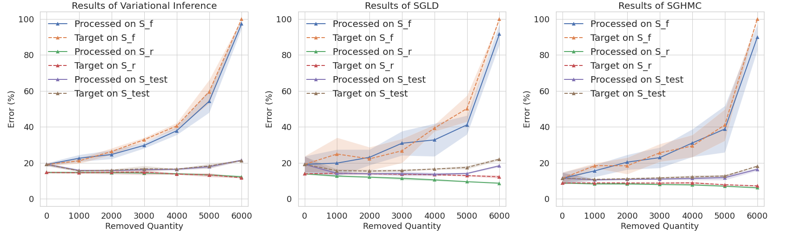

# Bayesian Inference Forgetting

This repository contains the PyTorch source code for technical report "Bayesian Inference Forgetting" by Shaopeng Fu, Fengxiang He, Yue Xu, and Dacheng Tao.

## Experiment results



*Figure 1. Experiments results of the Bayesian LeNet on the Fashion-MNIST dataset. The results show that the Processed models are similar to the target models, which demonstrates that the forgetting algorithms can remove the influences of specific datums from models without hurting other remaining information.*

## Requirements

- python 3.7
- pytorch 1.6.0
- torchvision 0.7.0
- numpy 1.19.1

## Instructions

The package `bayes_forgetters` contains all the code for variational inference forgetting and MCMC forgetting. Its code structure is as follows:

```
bayes_forgetters/
  |---- __init__.py
  |---- bif_forgetter.py
  |---- sgmcmc_forgetter.py
  |---- vi_forgetter.py
```

To perform forgetting, you have to first build a `forgetter`. Then, you can forget a batch of datums each time.

### Build module for variational inference forgetting

You need to implement the following two functions:

- `_fun(self,z)`, which is used to calculate $F(\gamma,S)$;
- `_z_fun(self,z)`, which is used to calculate $\sum_{z_j \in S^\prime} h(\gamma,z_j)$.

For example, you can build `viForgetter` for your variational Bayesian neural network (variational BNN) as follows:

```python
import bayes_forgetters

class viForgetter(bayes_forgetters.vbnnForgetter):
    def _fun(self, z):
        x, y = z
        if not self.cpu: x, y = x.cuda(), y.cuda()
        self.model.train()
        return self.model.F(z)

    def _z_fun(self, z):
        x, y = z
        if not self.cpu: x, y = x.cuda(), y.cuda()
        self.model.train()
        return self.model.h(z)

forgetter = viForgetter(model=model, params=model.parameters(), cpu=False, iter_T=64, scaling=0.1, bbp_T=5)
```

where `model` is the variational BNN, `iter_T` is the number of recursion of calculating the inverse Hessian matrix, and `bbp_T` is the number of backpropagations when performing "Bayes by Backprop" (BBP) for variational BNN.

### Build module for MCMC forgetting

You need to implement the following three functions:

- `_apply_sample`, which is used to perform MCMC sampling;

- `_fun(self,z)`, which is used to calculate $F(\gamma,S)$;
- `_z_fun(self,z)`, which is used to calculate $\sum_{z_j \in S^\prime} h(\gamma,z_j)$.

For example, you can build `mcmcForgetter` for your MCMC Bayesian neural network (MCMC BNN) as follows:

```python
import bayes_forgetters

class mcmcForgetter(bayes_forgetters.sgmcmcForgetter):
    def _apply_sample(self, z):
        x, y = z
        if not self.cpu: x, y = x.cuda(), y.cuda()
        self.model.train()
        lo = self.model.F(z)
        self.optimizer.zero_grad()
        lo.backward()
        self.optimizer.step()

    def _fun(self, z):
        x, y = z
        if not self.cpu: x, y = x.cuda(), y.cuda()
        self.model.train()
        return self.model.F(z)

    def _z_fun(self, z):
        x, y = z
        if not self.cpu: x, y = x.cuda(), y.cuda()
        self.model.train()
        return self.model.h(z)

forgetter = mcmcForgetter(model=model, optimizer=optimizer, params=model.parameters(), cpu=False, iter_T=64, scaling=0.1, samp_T=5)
```

where `model` is the neural network, `optimizer` is an SGMCMC sampler, `iter_T` is the number of recursion of calculating the inverse Hessian matrix, and `samp_T` is the number of Monte Carlo sampling times for estimating the expectations in the MCMC influence function.

### Perform Bayesian inference forgetting

You can forget a batch of datums `[xx,yy]` from your Bayesian model as follows:

```python
forgetter.param_dict['scaling'] = init_scaling / remaining_n
forgetter.forget([xx,yy], remaining_sampler)
```

where `remaining_sampler` is an iterable that can repeatedly draw a batch of datums from the current remaining set.

It is recommended to set the scaling factor `scaling` as `init_scaling / remaining_n`, where `init_scaling` is the initial scaling factor, `remaining_n` is the number of the currently remaining datums. Also, you need to adjust `init_scaling` to let the recursive calculation of the inverse Hessian matrix converge.

## Instruction for reproduce results

To reproduce the results in this paper, please see [here](./scripts/README.md).

## Citation

```latex
@article{fu2021bayesian,
  title={Bayesian Inference Forgetting}, 
  author={Fu, Shaopeng and He, Fengxiang and Xu, Yue and Tao, Dacheng},
  journal={arXiv preprint arXiv:2101.06417},
  year={2021}
}
```

## Contact

For any issues please kindly contact

Shaopeng Fu, [shaopengfu15@gmail.com](mailto:shaopengfu15@gmail.com)   
Fengxiang He, [fengxiang.f.he@gmail.com](mailto:fengxiang.f.he@gmail.com)   
Yue Xu, [xuyue502@mail.ustc.edu.cn](mailto:xuyue502@mail.ustc.edu.cn)   
Dacheng Tao, [dacheng.tao@gmail.com](mailto:dacheng.tao@gmail.com)   

--

Last update: Fri 15 Jan 2021 AEDT
